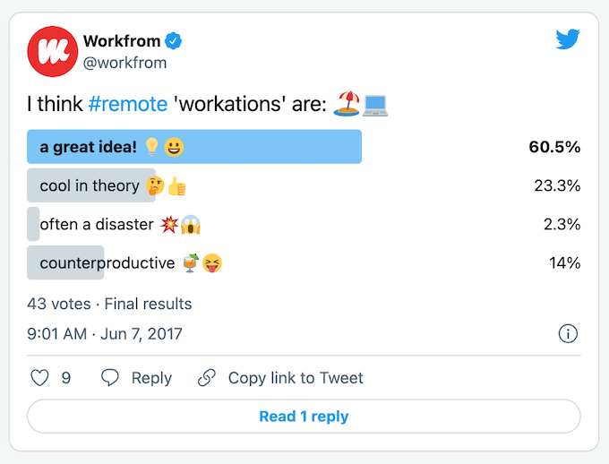

## Start
Morning everyone.

Please raise your hands if you've ever worked remotely on a caribbean island.

## Bali
Do you know that Bali is not only a gorgeous place for vacation, but one of the best places to work remotely?

# Who, Why
Hello everybody. 

I am Cristiam, a software developer, and today we would dig on the amazing world of working and traveling at the same time. Workation

# What, How

I would like to cover three main points.

- First, I will explain What is Workation and why is a huge trend for developers now.
- Second, I would like to show how it could benefits you
- Finally, we are going to plan our next month on Bali, together!

The workshop should last about five minutes and I'm happy to take any questions at any time.

## 1.1 Worktation.

Worktation, ‘workoliday’ or ‘woliday’, 
Working while on vacation (work + vacation = workation).

As HR Technologist puts it:

> ‘A workation is a vacation that allows you to work remotely while integrating elements of leisure that let you unwind, relax and be more productive’.

## 1.1 What people think about

## 1.2: Types of workation

Short-term: just few days.

Medium-term: few weeks

Long-term: relocates to another area. 

## 1.3: Keys

- Peace and quiet
- Low cost of living
- Excellent internet access

## 1.3: Living in Bali

[Source: ](https://digitalnomads.world/city-guide/bali/#Costs)

## 1.3: Barriers are going down

# 2 Benefits
## 2.1 Increase Productivity

According to [Timestatic](https://timetastic.co.uk/blog/what-is-a-workation) and also in words of [TouristTeacher]( https://tourismteacher.com/workation/)

Going on a workation can help to increase productivity. If a person is more productive, then the company can make more money- so this seems like a pretty big benefit to me!

Two main reasons. The first, is that they do not have many of their home commitments- no/fewer chores to do, no unexpected visits from friends and family, no daily commute.

Secondly, we often have less distractions when on workation. There are no colleagues knocking on the office door and no extended lunch breaks with friends.

Of course, there is an element of self-discipline required with a workation, but research has proved that working remotely can make workers more productive.

## 2.2 Enhanced quality and creatitivy

Wortkations can also help to improve the quality of work. When people have less distractions, less pressure and are more relaxed they produce better work.

There is a reason that people go away on ‘writing retreats’…. 

People can also be more creative while on workation. Again, this is because there are less distractions.

Many people claim that being amongst nature can help to enhance creativity. It is for this reason that rural tourism areas are often popular workation bases.

## 2.3  Improved staff retention

When people are happy at work they are less likely to leave.

Maslow covered this topic really well in his work on motivation. He proved that when staff are happy and healthy, they are less likely to quit their jobs.

# Point 3: Planning and tips

we are going to plan our next month on Bali, together
- First: the tickets. Buying the tickets would ensure you would travel
- Next: plan where to stay: internet connection, security, etc
- finally... your luggages...

# Finish

## signal
So, that brings me to the end of the presentation

## summary
We have covered these points.

- First, I've explained What is Workation and why is a huge trend for developers now.
- Second, I've showed how it could benefits you
- Finally, we've planned our next trip to Bali!

## conclusion
Worktations defines a fine line between holiday, remote work and sabbaticals. That  line is defined by ourselves and it is related with our definition of healthy work-life balance. Furthermore, the concept of Workation has been accelerated when the world turned digital during the COVID-19 pandemic and it is irreversible. 

Just plan your next destination and go for that. 

## clossing remarks
Thank you for your attention.

https://appunite.com/blog/workation-2-work-and-travel

