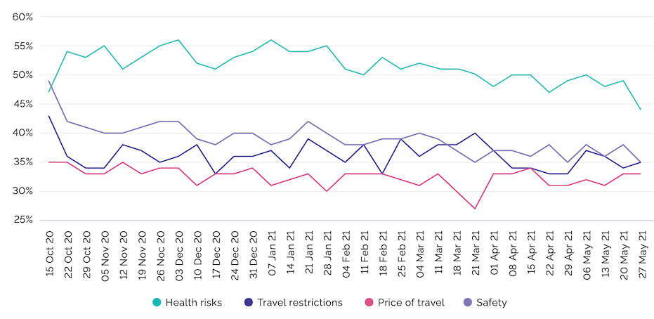

## Start
Morning everyone.

Please raise your hands if you've ever worked remotely on a caribbean island.

## Bali
Do you know that Bali is not only a gorgeous place for vacation, but one of the best places to work remotely?

# Who, What
Hello everybody. 

I am Cristiam, a software developer, and today we would dig on the amazing world of working and traveling at the same time. Workation

# Agenda

I would like to cover three main points.

- First, I will explain What is Workation and why is a huge trend for developers now.
- Second, I would like to show how it could benefits you
- Finally, we are going to plan our next month on Bali, together!

The workshop should last about five minutes and I'm happy to take any questions at any time.

## 1.1 Corktation.

Worktation, ‘workoliday’ or ‘woliday’, 
Working while on vacation (work + vacation = workation).

As HR Technologist puts it:

> ‘A workation is a vacation that allows you to work remotely while integrating elements of leisure that let you unwind, relax and be more productive’.

## 1.1 What people think about

## 1.2: Types of workation

Short-term: just few days.

Medium-term: few weeks

Long-term: relocates to another area. 

## 1.3: Keys

- Peace and quiet
- Low cost of living
- Excellent internet access

## 1.3: Living in Bali

[Source: ](https://digitalnomads.world/city-guide/bali/#Costs)

## 1.3: Barriers are going down

# Point 2: Benefits 

how it could benefits you

According to Timestatic... https://timetastic.co.uk/blog/what-is-a-workation 

The benefis are: one, two, trhee

# Point 3: Planning and tips

we are going to plan our next month on Bali, together
- First: the tickets. Buying the tickets would ensure you would travel
- Next: plan where to stay: internet connection, security, etc
- finally... your luggages...

# Finish

## signal
So, that brings me to the end of the presentation

## summary
We have covered these points.

- First, I've explained What is Workation and why is a huge trend for developers now.
- Second, I've showed how it could benefits you
- Finally, we've planned our next trip to Bali!

## conclusion
Worktations defines a fine line between holiday, remote work and sabbaticals. That  line is defined by ourselves and it is related with our definition of healthy work-life balance. Furthermore, the concept of Workation has been accelerated when the world turned digital during the COVID-19 pandemic and it is irreversible. 

Just plan your next destination and go for that. 

## clossing remarks
Thank you for your attention.

https://appunite.com/blog/workation-2-work-and-travel

